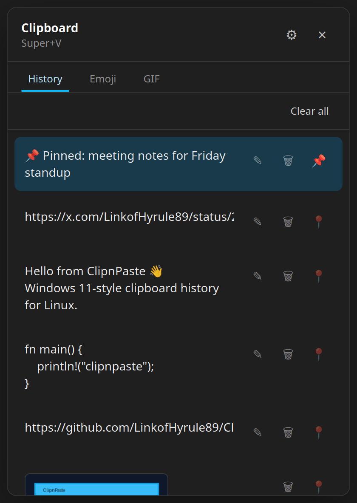
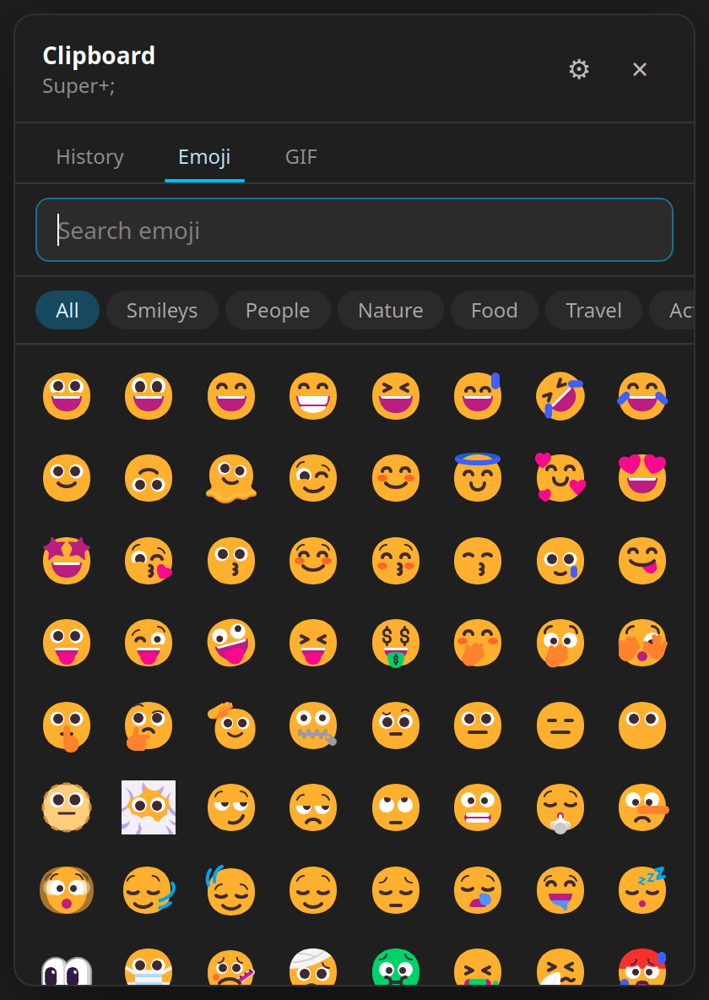
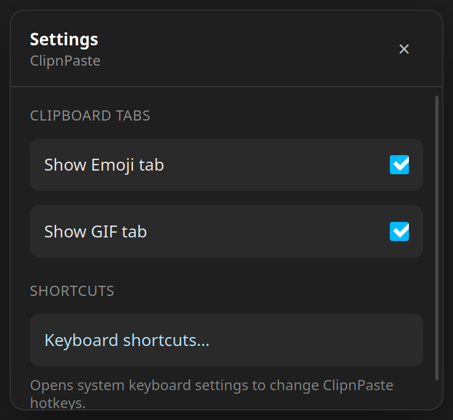
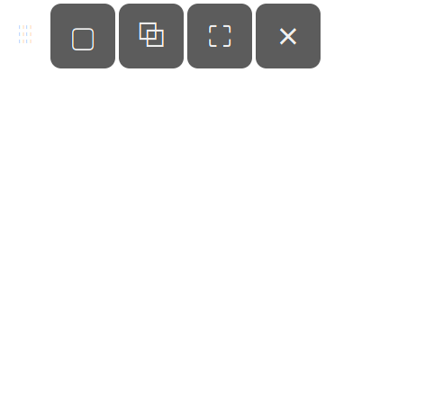

# ClipnPaste

**Windows 11-style clipboard history and snipping tool** for Linux Mint and other Debian-based desktops (X11 / Cinnamon).

**Current version: [0.2.7](https://github.com/LinkofHyrule89/ClipnPaste/releases/tag/v0.2.7)** · [Changelog](CHANGELOG.md)

## Features

- **Live clipboard history** — text and images appear in the Super+V list as you copy (including image-first capture when both formats exist)
- **Windows 11-style paste** — click a history item to paste into the previous app; that item becomes the system clipboard so **Ctrl+V** pastes it again
- **Edit text clips** — ✎ next to delete/pin; save updates the list and preview
- **Pin**, delete, and clear unpinned items
- **Image thumbnails** in history; full image used for paste
- **Emoji picker** (`Super+;`) — offline search, categories, Fluent UI assets
- **Settings** — show/hide Emoji and GIF tabs; open system keyboard shortcuts
- **Snipping tool** (`Super+Shift+S`) — fullscreen, window, or region; toast + annotation editor
- Local-only data (no network required at runtime)

## Screenshots

<p>




</p>

## Hotkeys

| Shortcut | Action |
|----------|--------|
| `Super+V` | Open clipboard history |
| `Super+;` | Open emoji picker |
| `Super+Shift+S` | Open snipping toolbar |
| `Ctrl+V` | Normal OS paste (not handled by ClipnPaste) |

**How paste works:** copying in any app fills history; **Ctrl+V** always uses the system clipboard. Choosing an item in Super+V writes it to the clipboard, moves it to the top of history, and pastes into the app you were using.

On Cinnamon, Super shortcuts are registered under **System Settings → Keyboard → Shortcuts → Custom Shortcuts** so Mint Menu can keep Super.

## Install with apt (GitHub Pages repo)

Free community repo (not official Debian/Mint). **amd64** only. The package name is `clipn-paste`.

```bash
curl -fsSL https://linkofhyrule89.github.io/ClipnPaste/install.sh | sudo bash
```

Or manually:

```bash
echo 'deb [arch=amd64 trusted=yes] https://linkofhyrule89.github.io/ClipnPaste stable main' \
  | sudo tee /etc/apt/sources.list.d/clipnpaste.list
sudo apt update
sudo apt install clipn-paste
clipnpaste &
```

After new GitHub releases, `sudo apt update && sudo apt upgrade` picks up updates when the apt site is refreshed (automatic on each release via Actions).

## Install from GitHub release (.deb)

Download the latest `ClipnPaste_*_amd64.deb` from [Releases](https://github.com/LinkofHyrule89/ClipnPaste/releases):

```bash
sudo apt install ./ClipnPaste_*_amd64.deb
clipnpaste &
```

Or log out and back in so autostart picks up the app.

## Uninstall

Stop the app if it is running, then remove the package:

```bash
pkill -x clipnpaste 2>/dev/null || true
sudo apt remove clipn-paste
```

To also drop app data and the apt source (if you used the GitHub Pages repo):

```bash
sudo apt purge clipn-paste
sudo rm -f /etc/apt/sources.list.d/clipnpaste.list
sudo apt update
```

Optional: delete local history/settings (`~/.local/share/clipnpaste/`), a local build override (`~/.local/bin/clipnpaste`), and user autostart/desktop entries under `~/.local/share/applications/` and `~/.config/autostart/` if present.

## Requirements (build)

```bash
sudo apt install curl build-essential libwebkit2gtk-4.1-dev \
  libgtk-3-dev libayatana-appindicator3-dev librsvg2-dev \
  libssl-dev libx11-dev libxfixes-dev patchelf pkg-config xdotool
```

Rust and Node.js 20+.

## Development

```bash
cd ClipnPaste
npm install
npm run tauri dev
```

Unit tests (DB flows, clear-all / re-copy gate, pin, edit, promote, text-vs-image policy — no display required):

```bash
npm test
# or: cargo test --manifest-path src-tauri/Cargo.toml --lib
```

Local production install:

```bash
./scripts/build-release.sh
./scripts/install-local.sh
```

## Build Debian package

```bash
./scripts/build-deb.sh
```

Output: `src-tauri/target/release/bundle/deb/ClipnPaste_*_amd64.deb`

## Data location

All app data stays on disk locally:

| Path | Purpose |
|------|---------|
| `~/.local/share/clipnpaste/history.db` | Clipboard history |
| `~/.local/share/clipnpaste/settings.json` | UI settings |
| `~/.local/share/clipnpaste/ipc.sock` | Hotkey / CLI IPC |

## CLI

With the app running:

```bash
clipnpaste-cli clipboard   # Super+V
clipnpaste-cli emoji       # Super+;
clipnpaste-cli snip        # Super+Shift+S
clipnpaste-cli settings    # Settings window
```

## License

See [LICENSE](LICENSE).
